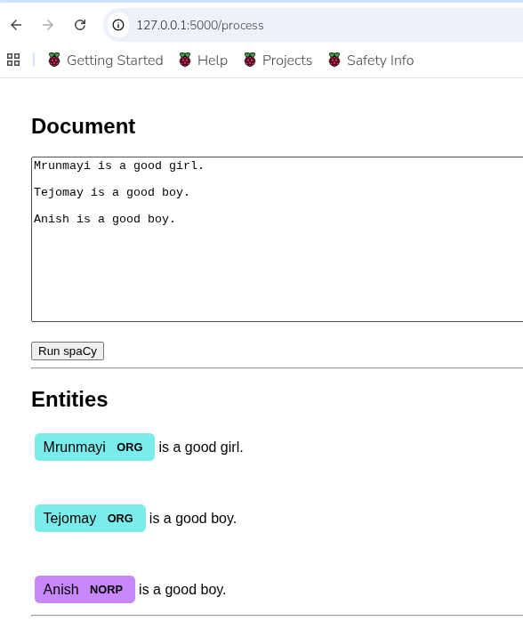
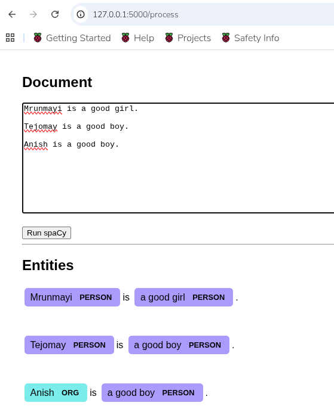
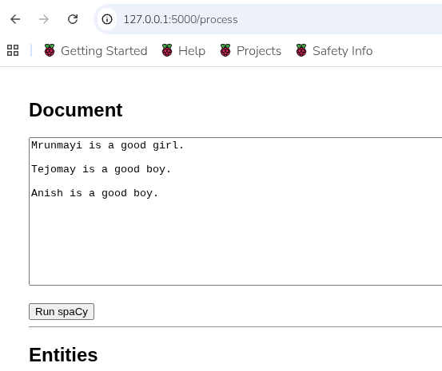
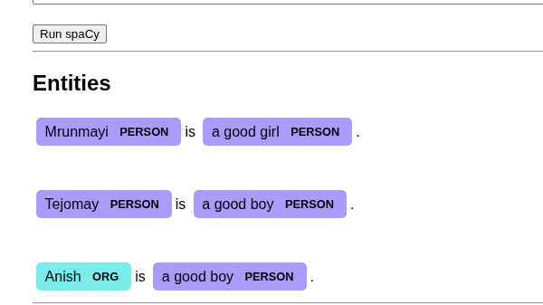
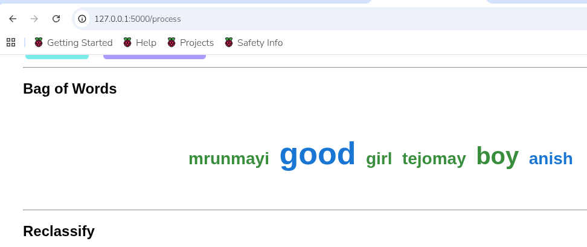
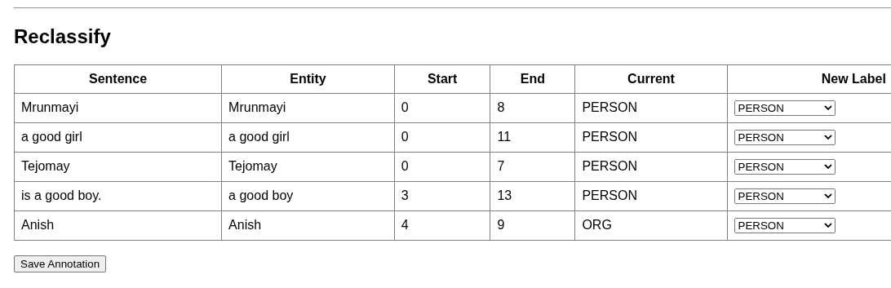
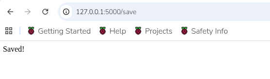
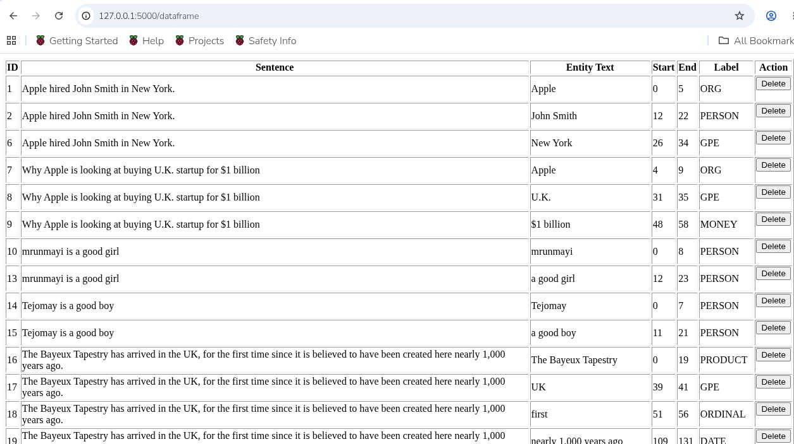

# Trainable NER with Spacy
This UI helps in classification of entities and persist them to a DB

## Before Training for the new entities

## After training for the new entities



## UI Guide
**The UI is divided into the following sections:**
### 1. Provide the input text here and click the "Run Spacy" button

### 2. This section shows entities that have been currently detected along with their types

### 3. This is a "Bag of Words" section so that we can get an intutive context of the above text

### 4. This section allows for reclassification of the detected entities and persist them to a Database

#### a. The new reclassified entities have been saved to the DB

#### b. Some validations for duplicates etc. are performed before saving 
### 5. This page provides the delete ability to remove the label entries from the DB


## Training for the new entities
### Convert the data
The above newly extracted data needs to be converted to IOB format for spacy to train.
Meaning it has a certain structure wherein the entities within a sentence have a start, end offset. 
Also, there can be multiple entities in a sentence.

The DocBin object serves this purpose and creates **train_self.spacy** file to split and train on

   ``` 
   cd utilities
   python3 Extract_Data.py
   ```   

### Split into train and test datasets
This data is then split into train and test sets.
This is done using 
   ``` 
   cd utilities
   python3 Split_Into_Train_testSets.py
   ``` 

### Train on the data
The command used to train using the the extracted spacy files is:
   ``` 
   cd ../
   python -m spacy train config.cfg --output ./output --paths.train ./trainingData/train_data.spacy --paths.dev ./trainingData/test_data.spacy --initialize.init_tok2vec en_core_web_sm
   ``` 
   
The switch --initialize does an initialization of the tok2vec layer of your model using the pretrained weights from the en_core_web_sm model instead of starting from random weights.

## Running the app using newly trained data
### Make sure that the data is loaded
My application uses the following pipeline:
 ["tok2vec","parser","senter","lemmatizer", "ner"]
 
So, I need the above components from the Spacy library, copying them thus : 
   ```
    cp -r /myuserxx/jupyter_env/lib/python3.13/site-packages/en_core_web_sm/en_core_web_sm-3.8.0/senter /myuserxx/ner_annotation/output/model-last/
	cp -r /myuserxx/jupyter_env/lib/python3.13/site-packages/en_core_web_sm/en_core_web_sm-3.8.0/parser /myuserxx/ner_annotation/output/model-last/
	cp -r /myuserxx/jupyter_env/lib/python3.13/site-packages/en_core_web_sm/en_core_web_sm-3.8.0/senter /myuserxx/ner_annotation/output/model-last/
	cp -r /myuserxx/jupyter_env/lib/python3.13/site-packages/en_core_web_sm/en_core_web_sm-3.8.0/parser /myuserxx/ner_annotation/output/model-last/
	cp -r /myuserxx/jupyter_env/lib/python3.13/site-packages/en_core_web_sm/en_core_web_sm-3.8.0/lemmatizer /myuserxx/ner_annotation/output/model-last/
	cp -r /myuserxx/jupyter_env/lib/python3.13/site-packages/en_core_web_sm/en_core_web_sm-3.8.0/parser /myuserxx/ner_annotation/output/model-last/
	cp -r /myuserxx/jupyter_env/lib/python3.13/site-packages/en_core_web_sm/en_core_web_sm-3.8.0/senter /myuserxx/ner_annotation/output/model-last/
   ```
**The app now recoginises the newly entities it was trained on**

## Hardware used to train model
Raspberry Pi4GB
